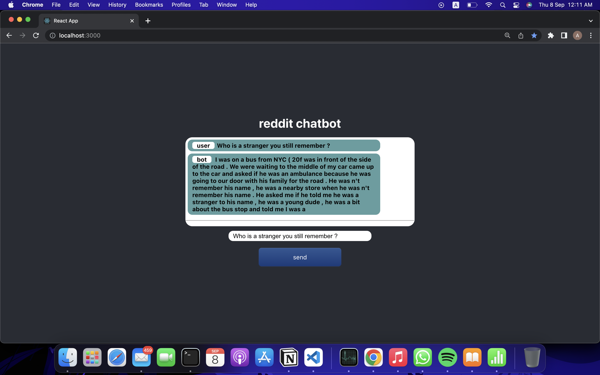

# reddit chatbot 
this chatbot app made from scratch with scraped data from reddit , pytorch model , fastapi backend server , react 

 


## how the app was made


### first we needed the data so we scraped 'askreddit' subreddit and created csv file with scrap.py script 

```bash 
python model/scrap.py 
``` 

### train the model so we build seq2seq transformer with pytorch and created our data pipeline 
run model/chatbot.ipynb notebook cells 

###  create the app 
backend : server we used fastapi we loaded the model and vocab_transform and we made the predict function  

```bash 
cd backend 
uvicorn inference:app --reload 
``` 

frontend : we created simple interface with react and we used axios to make our requests 

```bash 
cd frontend 
npm install 
npm start 
``` 

### the bot can be improved by using bigger  and more topic specific dataset 


